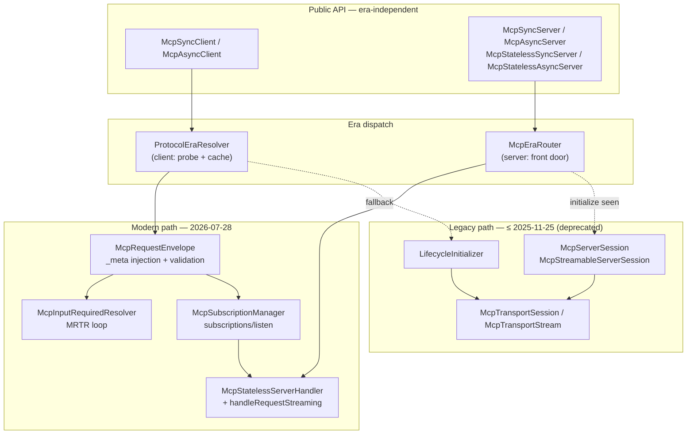
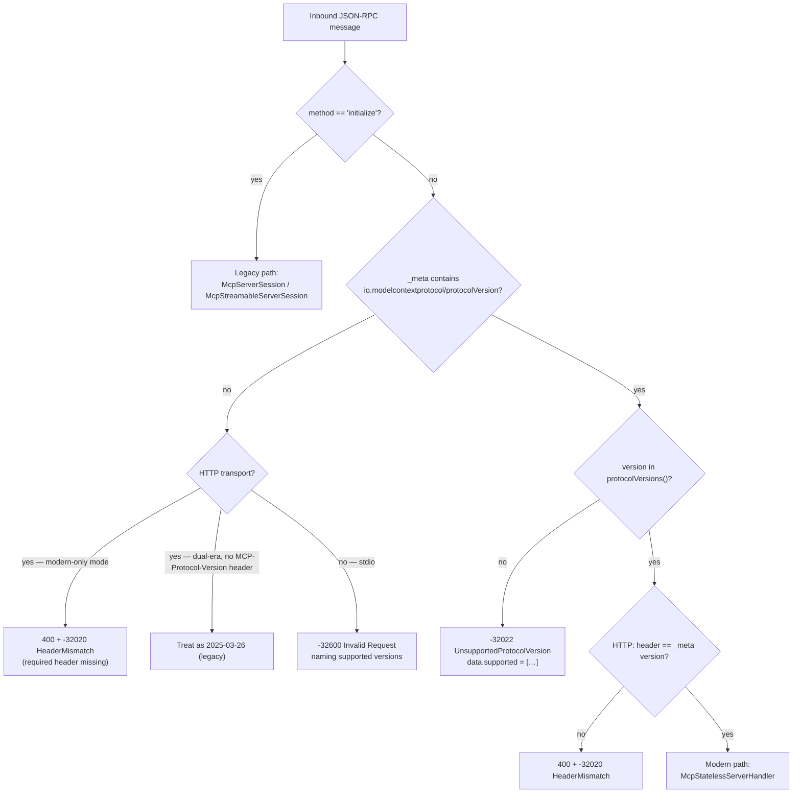
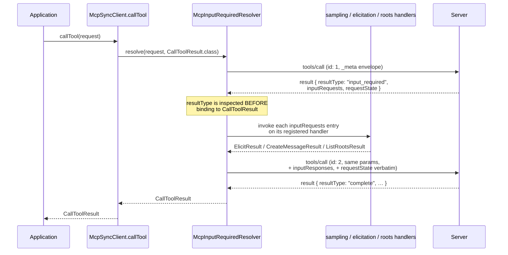
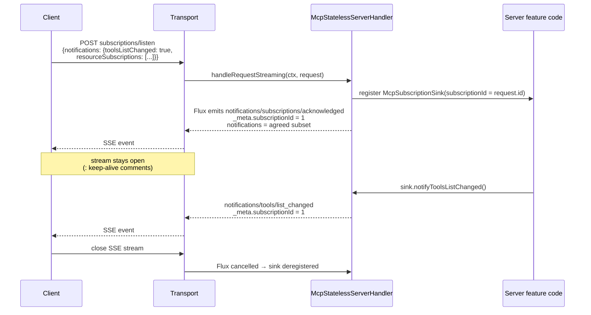

# JSDP-1: MCP `2026-07-28` Protocol Revision Support in the MCP Java SDK

## Status

| Field | Value |
| --- | --- |
| **Status** | Under Discussion |
| **Proposal type** | Java SDK Design Proposal (JSDP) |
| **Target SDK version** | `3.0.0` (current `main`: `2.0.1-SNAPSHOT`) |
| **Spec revision** | [`2026-07-28`](https://modelcontextprotocol.io/specification/2026-07-28) |
| **Highest revision implemented today** | [`2025-11-25`](https://modelcontextprotocol.io/specification/2025-11-25) |
| **Breaking change** | Yes — see [Compatibility, Deprecation, and Migration Plan](#compatibility-deprecation-and-migration-plan) |
| **Affected modules** | `mcp-core`, `mcp-test`, `conformance-tests`, `mcp-bom`, `docs` |
| **Reference implementation** | LangChain4j client-side implementation, [langchain4j/langchain4j#5881](https://github.com/langchain4j/langchain4j/pull/5881) |
| **Related SEPs** | SEP-2567, SEP-2575, SEP-2322, SEP-2663, SEP-2243, SEP-2549, SEP-2577, SEP-2596, SEP-2106, SEP-414 |

> **Note on process.** This document is a design proposal prepared for discussion. Per
> `AGENTS.md` in this repository, no issue, pull request, or discussion has been or will be
> filed upstream on the basis of this document without an explicit, separately authorised
> decision by a maintainer with standing in the project.

---

## Table of Contents

1. [Motivation](#motivation)
2. [Public Interfaces](#public-interfaces)
3. [Proposed Changes](#proposed-changes)
4. [Security Hardening](#security-hardening)
5. [Compatibility, Deprecation, and Migration Plan](#compatibility-deprecation-and-migration-plan)
6. [Test Plan](#test-plan)
7. [Reference Implementation](#reference-implementation)
8. [Documentation Plan](#documentation-plan)
9. [Rejected Alternatives](#rejected-alternatives)
10. [FAQ](#faq)

---

## Motivation

### Background

The MCP Java SDK (`io.modelcontextprotocol.sdk`) is the *formal*, specification-owned Java
implementation of the Model Context Protocol. Its stated job, per `CONTRIBUTING.md`, is to
implement the MCP specification — and per `ROADMAP.md`, the project's declared goal is
**Tier 1 SDK support**: "fully support all the upcoming specification features on the day of
its release."

The SDK currently implements protocol revisions `2024-11-05` through `2025-11-25`. Every one
of those revisions shares a single structural assumption: **an MCP conversation is a session
established by an `initialize` handshake**, over which either party may originate JSON-RPC
requests at any time.

The `2026-07-28` revision deletes that assumption.

### Motivating Question

> How does an SDK whose entire client and server core is built around a stateful
> `initialize` handshake and bidirectional request origination absorb a revision that removes
> both — without abandoning the ~4 years of deployed servers and clients that still speak the
> handshake?

This is not a feature-addition question. Six of the nine *major* changes in `2026-07-28`
are removals or inversions of mechanisms that `mcp-core` models as load-bearing types:
`McpServerSession`, `McpStreamableServerSession`, `LifecycleInitializer`,
`McpTransportSession`, `McpTransportStream`, and the client-side request handlers for
`roots/list`, `sampling/createMessage`, and `elicitation/create`.

### What the `2026-07-28` Revision Changes

Summarised from the [official changelog](https://modelcontextprotocol.io/specification/2026-07-28/changelog).

#### Major changes

| # | Change | SEP | Structural impact on this SDK |
| --- | --- | --- | --- |
| 1 | Remove protocol-level sessions and the `Mcp-Session-Id` header from Streamable HTTP. List endpoints no longer vary per connection. Cross-call state moves to server-minted handles passed as ordinary tool arguments. | SEP-2567 | Removes the reason `McpStreamableServerSession` exists on the modern path. |
| 2 | Make MCP stateless: remove the `initialize` / `notifications/initialized` handshake. Every request carries its protocol version and client capabilities in `_meta`. Version mismatch ⇒ `UnsupportedProtocolVersionError`. | SEP-2575 | Deletes `LifecycleInitializer` from the modern path; every request gains a mandatory envelope. |
| 3 | Add `server/discover`. Servers **MUST** implement it. Clients **MAY** call it for up-front version selection, or use it as a backward-compatibility probe on stdio. | SEP-2575 | New mandatory server RPC; new client probe. |
| 4 | Replace the HTTP `GET` endpoint and `resources/subscribe` / `resources/unsubscribe` with `subscriptions/listen`: one long-lived POST-response stream carrying opted-in notifications, tagged with `io.modelcontextprotocol/subscriptionId`. | SEP-2575 | Inverts stream ownership: the client's *request* now owns the long-lived stream. |
| 5 | Remove `ping`, `logging/setLevel`, and `notifications/roots/list_changed`. Log level becomes per-request via `io.modelcontextprotocol/logLevel`; servers **MUST NOT** emit `notifications/message` for requests that omit it. | SEP-2575 | Removes three methods; makes logging request-scoped. |
| 6 | Move experimental tasks out of core into the `io.modelcontextprotocol/tasks` extension. `tasks/result` → polling via `tasks/get`; new `tasks/update`; `tasks/list` removed; unsolicited task handles allowed. | SEP-2663 | Tasks leave `mcp-core`. |
| 7 | **Multi Round-Trip Requests (MRTR)** replaces server-initiated requests. Servers return an `InputRequiredResult` (`resultType: "input_required"`) whose `inputRequests` carry the needed `elicitation/create` / `sampling/createMessage` / `roots/list` requests; the client retries the original request with `inputResponses`. | SEP-2322 | The single largest change. Server→client requests cease to exist on the wire. |
| 8 | All results carry a required `resultType`: `"complete"` or `"input_required"`. Results from earlier-protocol servers that omit it **MUST** be treated as `"complete"`. | SEP-2322 | Wire-format change across every `Result` record in `McpSchema`. |
| 9 | Remove SSE resumability and redelivery (`Last-Event-ID`, SSE event IDs). A broken stream loses the in-flight request; the client **MUST** re-issue it with a new request ID. | SEP-2575 | Removes `McpTransportStream` resumption logic on the modern path. |

#### Minor changes

| # | Change | SEP |
| --- | --- | --- |
| 1 | `extensions` field added to `ClientCapabilities` and `ServerCapabilities`. | — |
| 2 | OpenTelemetry trace-context propagation conventions for `_meta` keys (`traceparent`, `tracestate`, `baggage`). | SEP-414 |
| 3 | Servers **SHOULD** return `tools/list` in deterministic order (client caching, LLM prompt-cache hit rate). | — |
| 4 | Standard MCP request headers `Mcp-Method` and `Mcp-Name` **REQUIRED** on Streamable HTTP POSTs; custom headers from tool parameters via `x-mcp-header`. | SEP-2243 |
| 5 | `ttlMs` and `cacheScope` **required** on results of `tools/list`, `prompts/list`, `resources/list`, `resources/read`, `resources/templates/list` via a new `CacheableResult` interface. | SEP-2549 |
| 6 | Resource-not-found error code `-32002` → `-32602` (Invalid Params). | — |
| 7 | Authorization servers **SHOULD** include `iss` (RFC 9207); clients **MUST** validate it before redeeming the code. | SEP-2468 |
| 8 | Clients **MUST** specify `application_type` during Dynamic Client Registration. | SEP-837 |
| 9 | Client credentials are bound to the issuing authorization server; key by issuer, never reuse, re-register on change. | SEP-2352 |
| 10 | `inputSchema` / `outputSchema` loosened to any JSON Schema 2020-12 keywords; `structuredContent` any JSON value; `$ref` resolution requirements and composition-keyword resource bounds. | SEP-2106 |
| 11 | `notifications/elicitation/complete` and the `elicitationId` field of URL-mode elicitation (both introduced in `2025-11-25`) are removed. | — |
| 12 | Error-code allocation policy: `-32000`…`-32019` implementation-defined (existing SDK usage grandfathered), `-32020`…`-32099` reserved for the spec. Renumbering: `HeaderMismatch` `-32001`→`-32020`, `MissingRequiredClientCapability` `-32003`→`-32021`, `UnsupportedProtocolVersion` `-32004`→`-32022`. `HeaderMismatchError` added to the schema. | — |

#### Deprecations (feature lifecycle, minimum 12-month window)

| Feature | Suggested migration |
| --- | --- |
| **Roots** | Pass directories/files via tool parameters, resource URIs, or server configuration. |
| **Sampling** | Integrate directly with LLM provider APIs. |
| **Logging** | Log to `stderr` (stdio) or use OpenTelemetry. |
| HTTP+SSE transport (deprecated since `2025-03-26`) | Reclassified Deprecated under the lifecycle policy — migrate to Streamable HTTP. |
| `includeContext` values `"thisServer"` / `"allServers"` | Omit the field, or use `"none"`. |
| OAuth 2.0 Dynamic Client Registration (RFC 7591) | Client ID Metadata Documents. |

### Existing Implementations and Gap Analysis

The following table is the result of an audit of `mcp-core` on `main` at commit `8ee8ccbc`.

| Spec requirement (`2026-07-28`) | Current state in `mcp-core` | Gap classification |
| --- | --- | --- |
| Protocol version `2026-07-28` advertised | `ProtocolVersions` stops at `MCP_2025_11_25`; `McpStatelessServerTransport.protocolVersions()` defaults to `[2025-03-26, 2025-06-18, 2025-11-25]` | **Additive** |
| No `initialize` handshake | `LifecycleInitializer` (357 LOC) gates every client call; `McpSchema.METHOD_INITIALIZE` handler registered by every server variant | **Structural** |
| No protocol sessions on HTTP | `McpStreamableServerSession` (468 LOC), `McpTransportSession`, `DefaultMcpTransportSession`, `MissingMcpTransportSession`, `McpTransportSessionNotFoundException` | **Structural** |
| Per-request `_meta` envelope (`protocolVersion`, `clientInfo`, `clientCapabilities`, `logLevel`) | `McpSchema.Meta` exists and every request/result record carries `_meta`, but nothing populates or validates the `io.modelcontextprotocol/*` keys | **Additive plumbing, central** |
| `server/discover` | Absent | **New feature** |
| `subscriptions/listen` + `notifications/subscriptions/acknowledged` | Absent. `METHOD_RESOURCES_SUBSCRIBE` / `_UNSUBSCRIBE` present. `McpStatelessServerHandler` is strictly request→single-response (`Mono<JSONRPCResponse>`), so it *cannot* express a long-lived stream. | **New feature + SPI extension** |
| MRTR (`InputRequiredResult`, `inputRequests`, `inputResponses`, `requestState`) | Absent. `McpAsyncClient` registers server→client request handlers at lines 225/235/255 for `roots/list`, `sampling/createMessage`, `elicitation/create` | **Structural** |
| `resultType` on every result | Absent from all `Result` records | **Wire-format, broad** |
| `CacheableResult` (`ttlMs`, `cacheScope`) | Absent | **Wire-format, targeted** |
| `Mcp-Method` / `Mcp-Name` request headers | Absent | **New feature** |
| `x-mcp-header` → `Mcp-Param-{Name}` mirroring | Absent. Favourable: `Tool.inputSchema` is already `Map<String, Object>`, so **no schema record change is required** | **New feature, no record change** |
| Header value Base64 sentinel encoding (`=?base64?…?=`) | Absent | **New utility** |
| `ping` / `logging/setLevel` / `notifications/roots/list_changed` removed | All three implemented and wired (e.g. `McpStatelessAsyncServer` registers `METHOD_PING`; `McpAsyncClient:484` sends it) | **Removal, era-gated** |
| Error codes `-32020` / `-32021` / `-32022`; `RESOURCE_NOT_FOUND` → `-32602` | `ErrorCodes` has `RESOURCE_NOT_FOUND = -32002`, `URL_ELICITATION_REQUIRED = -32042`; the three new codes absent | **Additive + era-gated change** |
| No SSE resumability | `DefaultMcpTransportStream` / `McpTransportStream` implement `Last-Event-ID` resumption; `HttpClientStreamableHttpTransport` honours it | **Removal, era-gated** |
| `extensions` on capabilities | Absent | **Additive** |
| Tasks as an extension | Tasks implemented in core for `2025-11-25` | **Relocation** |
| Stateless server exists | ✅ `McpStatelessAsyncServer` (850 LOC), `McpStatelessSyncServer`, `McpStatelessServerFeatures`, `DefaultMcpStatelessServerHandler`, `HttpServletStatelessServerTransport` | **Major asset — see below** |

### Why the Stateless Server Is the Foundation

The single most important finding of the audit: **the SDK already ships a stateless server.**

`McpStatelessAsyncServer`'s own Javadoc reads:

> "It allows simple horizontal scalability since it does not maintain a session and does not
> require initialization. Each instance of the server can be reached with no prior knowledge
> and can serve the clients with the capabilities it supports."

That is a near-verbatim description of the `2026-07-28` server model. This proposal therefore
does **not** introduce a parallel server implementation. It **promotes the existing stateless
server to be the canonical modern server**, and extends it in exactly two directions:

1. it must be able to answer one request with a *stream* (`subscriptions/listen`), and
2. it must be able to answer one request with *"I need more input"* (MRTR).

Both are additive SPI extensions to `McpStatelessServerHandler`. This is what makes the
proposal tractable at all: without the stateless server, `2026-07-28` support would be a
ground-up rewrite.

### Why a Design Proposal Rather Than Incremental PRs

Per `CONTRIBUTING.md`, non-trivial changes should have their scope clarified with maintainers
before implementation. Three properties of this revision make piecemeal delivery actively
harmful:

- **The changes are coupled.** `resultType` (change 8) is meaningless without MRTR (change 7);
  MRTR is unimplementable without the `_meta` envelope (change 2); the envelope is
  unverifiable without the header mirroring (minor 4). Landing them independently produces
  intermediate states that are on no protocol revision at all.
- **The era boundary must be decided once.** Whether "modern vs. legacy" is a runtime flag, a
  parallel type hierarchy, or separate modules determines the shape of every subsequent PR.
  Section [D1](#d1-era-split-at-the-server-front-door) makes this the first decision.
- **It is a major version.** Per `VERSIONING.md`, "changes to the MCP protocol version that
  require client/server code changes" and "removing support for a transport type" are both
  breaking. The removals in this revision must be batched into one `3.0.0`.

---

## Public Interfaces

All new and changed public API. Additions follow the `CONTRIBUTING.md` rules for evolving
wire-serialized records; each affected record notes whether **Case A** (optional field) or
**Case B** (spec-required field) applies.

### New Protocol Version Constant

```java
package io.modelcontextprotocol.spec;

public interface ProtocolVersions {

    String MCP_2024_11_05 = "2024-11-05";
    String MCP_2025_03_26 = "2025-03-26";
    String MCP_2025_06_18 = "2025-06-18";
    String MCP_2025_11_25 = "2025-11-25";

    /**
     * MCP protocol version for 2026-07-28.
     * https://modelcontextprotocol.io/specification/2026-07-28
     */
    String MCP_2026_07_28 = "2026-07-28";                              // new

    /** The newest revision this SDK implements. */
    String LATEST = MCP_2026_07_28;                                     // new

    /**
     * Revisions that convey version, identity and capabilities as per-request metadata
     * (2026-07-28 and later). The spec calls these "modern".
     */
    List<String> MODERN = List.of(MCP_2026_07_28);                      // new

    /**
     * Revisions that establish a session with an {@code initialize} handshake
     * (2025-11-25 and earlier). The spec calls these "legacy".
     */
    List<String> LEGACY = List.of(                                      // new
            MCP_2025_11_25, MCP_2025_06_18, MCP_2025_03_26, MCP_2024_11_05);

    /** @return {@code true} if {@code version} is a modern (per-request-metadata) revision. */
    static boolean isModern(String version) { … }                       // new
}
```

### New `_meta` Key Constants

```java
package io.modelcontextprotocol.spec;

/** Reserved {@code _meta} keys defined by the MCP specification. */
public final class McpMetaKeys {                                        // new class

    // Request envelope (2026-07-28, required on every request)
    public static final String PROTOCOL_VERSION     = "io.modelcontextprotocol/protocolVersion";
    public static final String CLIENT_INFO          = "io.modelcontextprotocol/clientInfo";
    public static final String CLIENT_CAPABILITIES  = "io.modelcontextprotocol/clientCapabilities";
    public static final String LOG_LEVEL            = "io.modelcontextprotocol/logLevel";

    // Result envelope
    public static final String SERVER_INFO          = "io.modelcontextprotocol/serverInfo";

    // Subscriptions
    public static final String SUBSCRIPTION_ID      = "io.modelcontextprotocol/subscriptionId";

    // Pre-existing, unprefixed
    public static final String PROGRESS_TOKEN       = "progressToken";

    // OpenTelemetry trace context propagation (SEP-414)
    public static final String TRACEPARENT          = "traceparent";
    public static final String TRACESTATE           = "tracestate";
    public static final String BAGGAGE              = "baggage";

    // Extension identifiers
    public static final String EXT_TASKS            = "io.modelcontextprotocol/tasks";
    public static final String EXT_UI               = "io.modelcontextprotocol/ui";
}
```

### New and Changed Method-Name Constants

```java
public final class McpSchema {

    // --- new in 2026-07-28 ---
    public static final String METHOD_SERVER_DISCOVER = "server/discover";
    public static final String METHOD_SUBSCRIPTIONS_LISTEN = "subscriptions/listen";
    public static final String METHOD_NOTIFICATION_SUBSCRIPTIONS_ACKNOWLEDGED =
            "notifications/subscriptions/acknowledged";

    // --- removed in 2026-07-28; retained, @Deprecated, legacy-era only ---
    @Deprecated public static final String METHOD_INITIALIZE = "initialize";
    @Deprecated public static final String METHOD_NOTIFICATION_INITIALIZED = "notifications/initialized";
    @Deprecated public static final String METHOD_PING = "ping";
    @Deprecated public static final String METHOD_LOGGING_SET_LEVEL = "logging/setLevel";
    @Deprecated public static final String METHOD_NOTIFICATION_ROOTS_LIST_CHANGED = "notifications/roots/list_changed";
    @Deprecated public static final String METHOD_RESOURCES_SUBSCRIBE = "resources/subscribe";
    @Deprecated public static final String METHOD_RESOURCES_UNSUBSCRIBE = "resources/unsubscribe";

    // --- removed outright (introduced in 2025-11-25, removed in 2026-07-28) ---
    // METHOD_NOTIFICATION_ELICITATION_COMPLETE  → deleted in 3.0.0
}
```

`roots/list`, `sampling/createMessage`, and `elicitation/create` keep their constants: under
MRTR they remain valid *method names inside `inputRequests`*, they simply stop being
standalone JSON-RPC requests on the wire.

### Error Codes

```java
public static final class ErrorCodes {

    public static final int PARSE_ERROR      = -32700;
    public static final int INVALID_REQUEST   = -32600;
    public static final int METHOD_NOT_FOUND  = -32601;
    public static final int INVALID_PARAMS    = -32602;
    public static final int INTERNAL_ERROR    = -32603;

    /**
     * @deprecated Legacy-era only. Since 2026-07-28 resource-not-found uses
     * {@link #INVALID_PARAMS} (-32602).
     */
    @Deprecated
    public static final int RESOURCE_NOT_FOUND = -32002;

    /** @deprecated URL-mode elicitation completion was removed in 2026-07-28. */
    @Deprecated
    public static final int URL_ELICITATION_REQUIRED = -32042;

    // --- MCP-reserved range -32020..-32099 (new) ---

    /** HTTP headers do not match the request body, or required headers are missing. */
    public static final int HEADER_MISMATCH = -32020;

    /** The request requires a client capability the client did not declare. */
    public static final int MISSING_REQUIRED_CLIENT_CAPABILITY = -32021;

    /** The server does not implement the requested protocol version. */
    public static final int UNSUPPORTED_PROTOCOL_VERSION = -32022;
}
```

### New Schema Records

#### `server/discover`

```java
/** @since 2026-07-28 */
public record ServerDiscoverRequest(
        @JsonProperty("_meta") Map<String, Object> meta) implements Request {}

/**
 * @param supportedVersions protocol versions the server supports (spec-required → Case B)
 * @param capabilities      capabilities the server supports (spec-required → Case B)
 * @param instructions      optional natural-language guidance for LLMs
 * @param resultType        "complete" (spec-required → Case B)
 * @param ttlMs             freshness hint in milliseconds
 * @param cacheScope        "public" or "private"
 * @param meta              carries io.modelcontextprotocol/serverInfo
 */
@JsonInclude(JsonInclude.Include.NON_ABSENT)
@JsonIgnoreProperties(ignoreUnknown = true)
public record DiscoverResult(
        @JsonProperty("supportedVersions") List<String> supportedVersions,
        @JsonProperty("capabilities")      ServerCapabilities capabilities,
        @JsonProperty("instructions")      String instructions,
        @JsonProperty("resultType")        String resultType,
        @JsonProperty("ttlMs")             Long ttlMs,
        @JsonProperty("cacheScope")        String cacheScope,
        @JsonProperty("_meta")             Map<String, Object> meta)
        implements Result, CacheableResult {

    public DiscoverResult { … }                  // Case B: defaults, never rejects on the wire

    @JsonCreator
    static DiscoverResult fromJson(…) { … }      // Case B Rule 2: tolerate absence, WARN

    /** Convenience accessor for {@code _meta['io.modelcontextprotocol/serverInfo']}. */
    public Implementation serverInfo() { … }

    public static Builder builder(List<String> supportedVersions,
                                  ServerCapabilities capabilities) { … }  // Case B Rule 3
}
```

#### Result typing and caching

```java
/** Values of the required {@code resultType} field. @since 2026-07-28 */
public static final class ResultTypes {
    public static final String COMPLETE       = "complete";
    public static final String INPUT_REQUIRED = "input_required";
}

public interface Result extends Meta {
    /**
     * How the peer answered. {@code "complete"} for ordinary results,
     * {@code "input_required"} for MRTR interim results. Results from
     * earlier-protocol servers that omit the field are treated as {@code "complete"}.
     * @since 2026-07-28
     */
    default String resultType() { return ResultTypes.COMPLETE; }
}

/**
 * A result that carries client-cacheability hints (SEP-2549). Implemented by the results of
 * tools/list, prompts/list, resources/list, resources/read, resources/templates/list and
 * server/discover.
 * @since 2026-07-28
 */
public interface CacheableResult extends Result {

    /** Freshness hint in milliseconds; {@code null} if the server gave none. */
    Long ttlMs();

    /** {@code "public"} or {@code "private"}; {@code null} if the server gave none. */
    String cacheScope();
}

public static final class CacheScopes {
    public static final String PUBLIC  = "public";
    public static final String PRIVATE = "private";
}
```

#### MRTR

```java
/**
 * A map of server-assigned identifier → server-to-client request. Values are
 * {@link ElicitFormRequest}, {@link ElicitUrlRequest}, {@link CreateMessageRequest},
 * or {@link ListRootsRequest}.
 * @since 2026-07-28
 */
public record InputRequests(Map<String, InputRequest> requests) { … }

/**
 * Request for the client's roots. New in 3.0.0: {@code roots/list} previously took no
 * params and had no request record — the client handler was registered against the bare
 * method name. MRTR requires it to be a first-class request object, because it appears as
 * a *value* inside {@link InputRequests}.
 *
 * @since 2026-07-28
 */
public record ListRootsRequest(
        @JsonProperty("cursor") String cursor,
        @JsonProperty("_meta")  Map<String, Object> meta) implements Request { … }

/** One entry of {@link InputRequests}: a {@code method} plus its {@code params}. */
public record InputRequest(
        @JsonProperty("method") String method,
        @JsonProperty("params") Object params) { … }

/** A map of identifier → client result, keyed to match {@link InputRequests}. */
public record InputResponses(Map<String, Object> responses) { … }

/**
 * A {@link Result} indicating the server needs more input before it can complete.
 * Servers MUST include at least one of {@code inputRequests} or {@code requestState}.
 *
 * @param requestState opaque, server-meaningful. Clients MUST NOT inspect, parse, modify,
 *                     or make assumptions about its contents, and MUST echo it verbatim.
 * @since 2026-07-28
 */
@JsonInclude(JsonInclude.Include.NON_ABSENT)
@JsonIgnoreProperties(ignoreUnknown = true)
public record InputRequiredResult(
        @JsonProperty("inputRequests") Map<String, InputRequest> inputRequests,
        @JsonProperty("requestState")  String requestState,
        @JsonProperty("resultType")    String resultType,
        @JsonProperty("_meta")         Map<String, Object> meta) implements Result { … }
```

`CallToolRequest`, `ReadResourceRequest`, and `GetPromptRequest` each gain two appended
components (**Case A**, appended at the end, boxed/nullable, existing constructors retained as
delegating overloads):

```java
public record CallToolRequest(
        @JsonProperty("name")      String name,
        @JsonProperty("arguments") Map<String, Object> arguments,
        @JsonProperty("_meta")     Map<String, Object> meta,
        @JsonProperty("inputResponses") Map<String, Object> inputResponses,   // new, Case A
        @JsonProperty("requestState")   String requestState) { … }            // new, Case A
```

#### Subscriptions

```java
/** @since 2026-07-28 */
public record SubscriptionsListenRequest(
        @JsonProperty("notifications") NotificationFilter notifications,
        @JsonProperty("_meta")         Map<String, Object> meta) implements Request {

    /** All fields optional; omitting one means "not subscribed to that type". */
    public record NotificationFilter(
            @JsonProperty("toolsListChanged")      Boolean toolsListChanged,
            @JsonProperty("promptsListChanged")    Boolean promptsListChanged,
            @JsonProperty("resourcesListChanged")  Boolean resourcesListChanged,
            @JsonProperty("resourceSubscriptions") List<String> resourceSubscriptions) { … }

    public static Builder builder() { … }
}

/** First message on a listen stream; reflects the subset the server agreed to honour. */
public record SubscriptionsAcknowledgedNotification(
        @JsonProperty("notifications") SubscriptionsListenRequest.NotificationFilter notifications,
        @JsonProperty("_meta")         Map<String, Object> meta) implements Notification { … }

/** Graceful-closure response to a long-lived subscriptions/listen request. */
public record SubscriptionsListenResult(
        @JsonProperty("resultType") String resultType,
        @JsonProperty("_meta")      Map<String, Object> meta) implements Result { … }
```

#### Errors with structured `data`

```java
/** Payload of the -32022 error. @since 2026-07-28 */
public record UnsupportedProtocolVersionData(
        @JsonProperty("supported") List<String> supported,
        @JsonProperty("requested") String requested) { … }

/** Payload of the -32021 error. @since 2026-07-28 */
public record MissingRequiredClientCapabilityData(
        @JsonProperty("capability") String capability) { … }
```

#### Capabilities `extensions`

Both records gain one appended **Case A** component:

```java
public record ClientCapabilities(
        …existing components…,
        @JsonProperty("extensions") Map<String, Object> extensions) { … }   // new, Case A

public record ServerCapabilities(
        …existing components…,
        @JsonProperty("extensions") Map<String, Object> extensions) { … }   // new, Case A
```

### Client API

```java
package io.modelcontextprotocol.client;

public interface McpClient {

    interface SyncSpec {

        /**
         * Protocol revision to speak. Defaults to {@link ProtocolEra#AUTO_DETECT}, which
         * probes modern-first and falls back to the newest legacy revision.
         */
        SyncSpec protocolVersion(String version);                    // new
        SyncSpec protocolEra(ProtocolEra era);                       // new

        /** Bound on how long the modern probe waits before assuming a legacy server. */
        SyncSpec protocolDetectionTimeout(Duration timeout);         // new

        /**
         * Maximum MRTR round trips the SDK will transparently perform for one logical
         * call before failing with {@link McpInputRequiredLimitExceededException}.
         * Defaults to 5.
         */
        SyncSpec maxInputRequiredRoundTrips(int max);                // new

        /** Per-request log level, sent as io.modelcontextprotocol/logLevel. */
        SyncSpec logLevel(LoggingLevel level);                       // new

        /** Declare support for an extension, e.g. io.modelcontextprotocol/tasks. */
        SyncSpec extension(String identifier, Object settings);      // new
    }
}

public enum ProtocolEra { MODERN, LEGACY, AUTO_DETECT }              // new

public interface McpSyncClient extends AutoCloseable {

    /** Server identity, capabilities and supported versions via {@code server/discover}. */
    DiscoverResult discover();                                       // new

    /**
     * Opens a long-lived notification stream. Registered change consumers are invoked for
     * notifications arriving on it. Close the returned handle to end the subscription.
     */
    McpSubscription listen(SubscriptionsListenRequest request);      // new

    /** @deprecated Removed in 2026-07-28. Throws on a modern server. Use {@link #listen}. */
    @Deprecated void subscribeResource(SubscribeRequest request);

    /** @deprecated Removed in 2026-07-28. Throws on a modern server. Use {@link #listen}. */
    @Deprecated void unsubscribeResource(UnsubscribeRequest request);

    /** @deprecated Removed in 2026-07-28. Throws on a modern server. */
    @Deprecated Object ping();

    /** @deprecated Removed in 2026-07-28. Set the level per request instead. */
    @Deprecated void setLoggingLevel(LoggingLevel level);

    /** @deprecated Roots are deprecated. Throws on a modern server. */
    @Deprecated void addRoot(Root root);
}

/** Handle to an open {@code subscriptions/listen} stream. @since 2026-07-28 */
public interface McpSubscription extends AutoCloseable {              // new

    /** The subscription ID — the JSON-RPC id of the originating request. */
    Object subscriptionId();

    /** The filter the server acknowledged, which may be narrower than requested. */
    SubscriptionsListenRequest.NotificationFilter acknowledged();

    /** {@code true} until the stream ends. */
    boolean isActive();

    /** Completes when the server sends the graceful-closure response. */
    Mono<Void> closed();       // async variant

    @Override void close();
}
```

**The sampling / elicitation / roots handler API does not change.** This is deliberate and is
the central ergonomic claim of this proposal — see [D3](#d3-mrtr-is-resolved-inside-the-client-session-layer).
`SyncSpec.sampling(handler)`, `.elicitation(handler)`, and `.roots(...)` keep their exact
signatures; under a modern server the SDK invokes the same handlers from the MRTR resolution
loop instead of from an inbound-request dispatcher.

### Server API

```java
package io.modelcontextprotocol.server;

/**
 * Handler for MCP requests in a stateless server context.
 * Extended in 3.0.0 to support streaming responses.
 */
public interface McpStatelessServerHandler {

    Mono<McpSchema.JSONRPCResponse> handleRequest(
            McpTransportContext ctx, McpSchema.JSONRPCRequest request);

    Mono<Void> handleNotification(
            McpTransportContext ctx, McpSchema.JSONRPCNotification notification);

    /**
     * Handle a request whose response is a stream: zero or more request-scoped
     * notifications followed by the terminal response. Used for
     * {@code subscriptions/listen} and for any request that emits progress or log
     * notifications. The default implementation adapts {@link #handleRequest}.
     *
     * @since 3.0.0
     */
    default Flux<McpSchema.JSONRPCMessage> handleRequestStreaming(              // new
            McpTransportContext ctx, McpSchema.JSONRPCRequest request) {
        return handleRequest(ctx, request).flux().cast(McpSchema.JSONRPCMessage.class);
    }

    /** @return {@code true} if this request must be answered with a stream. */
    default boolean isStreamingRequest(McpSchema.JSONRPCRequest request) {      // new
        return McpSchema.METHOD_SUBSCRIPTIONS_LISTEN.equals(request.method());
    }
}
```

```java
package io.modelcontextprotocol.spec;

public interface McpStatelessServerTransport {

    void setMcpHandler(McpStatelessServerHandler mcpHandler);

    default List<String> protocolVersions() {
        return List.of(ProtocolVersions.MCP_2026_07_28);   // changed default
    }

    /**
     * Legacy revisions this transport will additionally serve when dual-era mode is
     * enabled. Empty means modern-only.
     * @since 3.0.0
     */
    default List<String> legacyProtocolVersions() { return List.of(); }   // new

    Mono<Void> closeGracefully();
    default void close() { this.closeGracefully().subscribe(); }
}
```

New server-side feature specifications, mirroring the existing
`McpStatelessServerFeatures.AsyncToolSpecification` style:

```java
public final class McpStatelessServerFeatures {

    /**
     * A tool handler that may ask the client for more input. Returning
     * {@link McpSchema.InputRequiredResult} triggers an MRTR round trip.
     * @since 3.0.0
     */
    public record AsyncToolSpecification(
            McpSchema.Tool tool,
            BiFunction<McpTransportContext, McpSchema.CallToolRequest,
                       Mono<? extends McpSchema.Result>> callHandler) { … }
}
```

Server-side helpers for MRTR:

```java
package io.modelcontextprotocol.server;

/**
 * Seals and verifies the opaque {@code requestState} that a server round-trips through
 * the client. The default implementation is AEAD (AES-GCM) over a compact CBOR payload
 * binding the authenticated principal, a TTL, and a digest of the originating request.
 *
 * @since 3.0.0
 */
public interface McpRequestStateCodec {                                        // new

    String seal(McpRequestStateEnvelope envelope);

    /** @throws McpRequestStateVerificationException if integrity, TTL, principal or
     *          request binding fails. */
    McpRequestStateEnvelope open(String requestState, McpRequestStateBinding expected);

    /** HMAC-free, integrity-free codec. Only for servers where a tampered state can
     *  cause nothing worse than request failure. */
    static McpRequestStateCodec unprotected(McpJsonMapper mapper) { … }

    static McpRequestStateCodec aeadAesGcm(SecretKey key, Duration ttl, McpJsonMapper mapper) { … }
}

public record McpRequestStateEnvelope(
        String principal, Instant expiresAt, String requestDigest, Map<String, Object> state) {}
```

Server-side subscription registry:

```java
/**
 * Per-request view of an open {@code subscriptions/listen} stream, handed to server
 * feature code so it can emit change notifications.
 * @since 3.0.0
 */
public interface McpSubscriptionSink {                                         // new

    Object subscriptionId();

    SubscriptionsListenRequest.NotificationFilter acknowledged();

    Mono<Void> notifyToolsListChanged();
    Mono<Void> notifyPromptsListChanged();
    Mono<Void> notifyResourcesListChanged();
    Mono<Void> notifyResourceUpdated(String uri);

    /** Ends the subscription gracefully: sends the empty listen response, then closes. */
    Mono<Void> closeGracefully();
}
```

### Transport API

| Interface / class | Change |
| --- | --- |
| `HttpClientStreamableHttpTransport` | Gains `protocolEra`, mirrors `MCP-Protocol-Version` / `Mcp-Method` / `Mcp-Name` / `Mcp-Param-*`; modern mode stops sending `Mcp-Session-Id`, stops the standalone `GET`, stops `Last-Event-ID` resumption |
| `HttpServletStatelessServerTransport` | Gains streaming-response support for `subscriptions/listen`; returns `405` to `GET` / `DELETE` in modern-only mode; validates header↔body and returns `-32020` |
| `HttpServletStreamableServerTransportProvider` | Legacy-era only; `@Deprecated` |
| `HttpClientSseClientTransport`, `HttpServletSseServerTransportProvider` | `@Deprecated` (HTTP+SSE reclassified Deprecated) |
| `StdioClientTransport` | Gains the `server/discover` era probe and `protocolDetectionTimeout` |
| `StdioServerTransportProvider` | Dual-era dispatch; `subscriptions/listen` multiplexed by `subscriptionId` over the single channel |
| `McpTransportStream`, `DefaultMcpTransportStream` | `@Deprecated` — modern streams are not resumable |
| `McpTransportSession`, `DefaultMcpTransportSession`, `MissingMcpTransportSession`, `ClosedMcpTransportSession`, `McpTransportSessionNotFoundException` | `@Deprecated` — no protocol sessions on the modern path |

### New Utilities

```java
package io.modelcontextprotocol.util;

/**
 * Encodes and decodes MCP header values per the spec's Value Encoding rule. Values outside
 * printable ASCII (0x20–0x7E), with leading/trailing whitespace, or matching the sentinel
 * are wrapped as {@code =?base64?{base64}?=}.
 * @since 3.0.0
 */
public final class McpHeaderCodec {                                            // new
    public static String encode(String value) { … }
    public static String decode(String value) { … }
    public static boolean isEncoded(String value) { … }
}

/**
 * Extracts {@code Mcp-Param-{Name}} headers from a tool call by walking {@code x-mcp-header}
 * annotations in the tool's {@code inputSchema}, and validates those annotations against the
 * spec's constraints.
 * @since 3.0.0
 */
public final class McpParamHeaderExtractor {                                   // new

    /** @return header name → encoded value, for the given arguments. */
    public static Map<String, String> extract(
            Map<String, Object> inputSchema, Map<String, Object> arguments) { … }

    /**
     * @return the violations found, empty if the tool definition is valid. A client MUST
     *         exclude a tool with violations from {@code tools/list} results.
     */
    public static List<String> validate(Map<String, Object> inputSchema) { … }
}
```

### New Exceptions

```java
package io.modelcontextprotocol.spec;

/** Peer does not implement the requested protocol version (-32022). */
public class McpUnsupportedProtocolVersionException extends McpError {          // new
    public List<String> supportedVersions() { … }
    public String requestedVersion() { … }
}

/** The server asked for a capability the client did not declare (-32021). */
public class McpMissingClientCapabilityException extends McpError { … }         // new

/** Headers did not match the body, or required headers were missing (-32020). */
public class McpHeaderMismatchException extends McpError { … }                  // new

/** MRTR did not converge within {@code maxInputRequiredRoundTrips}. */
public class McpInputRequiredLimitExceededException extends McpError { … }      // new

/** A feature was used that the negotiated protocol revision does not support. */
public class McpUnsupportedFeatureException extends McpError {                  // new
    public String feature() { … }
    public String protocolVersion() { … }
}
```

### Module Layout

```text
mcp-core/                     protocol types, schema, client/server, transports
mcp-json/, mcp-json-jackson2/, mcp-json-jackson3/
mcp/                          aggregate dependency
mcp-bom/
mcp-test/
mcp-ext-tasks/            (new)  io.modelcontextprotocol/tasks extension  — SEP-2663
conformance-tests/
```

---

## Proposed Changes

### Architecture

#### The Era Model

The spec's own vocabulary drives the design:

- **Modern** — `2026-07-28`+. Version, identity and capabilities are per-request metadata.
  No handshake. No sessions. No server-initiated requests.
- **Legacy** — `2025-11-25` and earlier. `initialize` handshake, sessions, bidirectional
  request origination.
- **Dual-era** — an implementation that supports both.

The SDK ships **dual-era by default** on both sides.



*What it shows:* one public API, two internal protocol paths, chosen by an explicit dispatch
layer. *Why it matters:* the removals in `2026-07-28` are confined to the Legacy box, which
is deprecated rather than deleted, so `3.0.0` can serve a `2024-11-05` client and a
`2026-07-28` client from the same process.

### Key Design Decisions

#### D1: Era split at the server front door

**Decision.** Introduce `McpEraRouter` at the transport boundary, *not* an era flag threaded
through the existing session classes.

A dual-era server, per the spec, "selects its behavior from how the client opens": a request
carrying modern per-request `_meta` is served statelessly; an `initialize` request selects
legacy semantics. That is a routing decision on the first message, and it belongs in one
place.



Rejected alternative: a boolean `modern` field on the existing sessions
([RA-1](#ra-1-an-era-flag-on-the-existing-session-types)).

#### D2: The request envelope is handled centrally

**Decision.** `_meta` envelope injection (client) and extraction/validation (server) happen
once, in the session/handler layer — never per request record.

Every modern request must carry `io.modelcontextprotocol/protocolVersion`,
`io.modelcontextprotocol/clientInfo`, and `io.modelcontextprotocol/clientCapabilities`, and
may carry `io.modelcontextprotocol/logLevel`. Threading these through ~20 request records
would be an enormous, repetitive change and would put protocol concerns in data types.

Instead:

- **Client egress** — `McpClientSession.sendRequest` merges the envelope into `params._meta`
  immediately before serialization, preserving any caller-supplied `_meta` (notably
  `progressToken`). This is exactly where the LangChain4j reference implementation puts it
  (`DefaultMcpClient`, "inject required `_meta` fields on every request and notification").
- **Server ingress** — `McpEraRouter` parses the envelope into a new
  `McpRequestContext` and publishes it alongside the existing `McpTransportContext` in the
  Reactor context, so feature code reads `requestContext.clientCapabilities()` rather than
  a session field.

```java
/**
 * Per-request protocol metadata extracted from a modern request's {@code _meta}.
 * Replaces the role that session state played in legacy revisions.
 * @since 3.0.0
 */
public interface McpRequestContext {                                           // new

    String KEY = "MCP_REQUEST_CONTEXT";

    String protocolVersion();
    McpSchema.Implementation clientInfo();
    McpSchema.ClientCapabilities clientCapabilities();

    /** Empty unless the client asked for logs on this request. */
    Optional<McpSchema.LoggingLevel> logLevel();

    /** Extension identifier → settings, from the client's declared capabilities. */
    Map<String, Object> extensions();

    static McpRequestContext from(Map<String, Object> meta, McpJsonMapper mapper) { … }
}
```

**Consequence for logging.** Because servers "**MUST NOT** emit `notifications/message` for
requests that did not include this field", the log sink handed to feature code becomes
request-scoped and defaults to a no-op. `McpAsyncServerExchange.loggingNotification(...)` is
reimplemented on the modern path to check `requestContext.logLevel()` and drop the
notification when absent — a silent, spec-mandated behaviour change that must be called out
in the migration guide.

#### D3: MRTR is resolved inside the client session layer

**Decision.** The SDK resolves MRTR round trips *transparently*, reusing the existing
sampling / elicitation / roots handlers. Public client method signatures do not change.

This is the highest-leverage decision in the proposal. MRTR replaces server-initiated
requests, which in `mcp-core` are handled by request handlers registered in `McpAsyncClient`
(lines 225/235/255). The naive translation would surface MRTR to the user: `callTool()` would
return a union type, and every caller would write a retry loop. That would be a gratuitous
break for every existing user, and would push protocol mechanics into application code.

Instead, `McpInputRequiredResolver` sits between the typed client methods and the transport:



Implementation rules encoded in the resolver:

| Spec rule | Enforcement |
| --- | --- |
| Client MUST construct requested inputs before retrying | Each `inputRequests` entry dispatched to the handler registered for its `method`; entries whose capability was not declared cause the resolver to fail fast (the server violated a MUST NOT) |
| Client MUST echo `requestState` verbatim | Carried as an opaque `String`, never parsed; the resolver has no code path that inspects it |
| Client MUST NOT include `requestState` if absent | Retry builder copies the field only when present |
| JSON-RPC `id` MUST differ between attempt and retry | Retry always allocates a fresh id from `McpClientSession`'s counter |
| MRTR fields affect only the retry of *that* request | Resolver state is per-call, held on the stack; nothing is stored on the client |
| Server MAY return `InputRequiredResult` repeatedly | Loop, bounded by `maxInputRequiredRoundTrips` (default 5) |
| Only `prompts/get`, `resources/read`, `tools/call` may return it | Resolver is installed only on those three call paths; an `input_required` result on any other method is a protocol error |

**Server side.** A feature handler opts into MRTR by returning `InputRequiredResult` instead
of its normal result type — hence the widened
`Mono<? extends McpSchema.Result>` return type on the tool/prompt/resource specifications.
`DefaultMcpStatelessServerHandler` validates before dispatch that every `inputRequests` entry
the handler produced corresponds to a capability the client declared in
`io.modelcontextprotocol/clientCapabilities`, and returns `-32021`
`MissingRequiredClientCapability` if the handler asks for something the client cannot do.

#### D4: `resultType` as a spec-required record component

**Decision.** Append `resultType` to each concrete `Result` record as a **Case B**
(spec-required) component, and expose `Result.resultType()` as an interface default so
era-agnostic code can read it uniformly.

The alternative — an interface default method only — does not serialize: Jackson's record
handling emits declared components, so a default method on `Result` would never reach the
wire. Since the field is required on every result in `2026-07-28`, it must be a real
component.

Per `CONTRIBUTING.md` Case B this means, for each result record:

1. the canonical constructor substitutes `ResultTypes.COMPLETE` when `resultType` is `null`
   (Case B Rule 1's documented-safe-default form, which explicitly overrides Case A Rule 7);
2. a `@JsonCreator static fromJson(...)` tolerates the field's absence — required for
   backward compatibility with legacy servers, which the spec mandates be read as
   `"complete"`;
3. `@JsonCreator` stays off the canonical constructor (Case A Rule 6);
4. existing constructors are retained as delegating overloads.

Affected records: `CallToolResult`, `ListToolsResult`, `ListResourcesResult`,
`ListResourceTemplatesResult`, `ReadResourceResult`, `ListPromptsResult`, `GetPromptResult`,
`CompleteResult`, `CreateMessageResult`, `ElicitResult`, `ListRootsResult`,
`InitializeResult` (legacy only, defaults `"complete"` and is never emitted on the modern
path), plus the new `DiscoverResult`, `InputRequiredResult` and `SubscriptionsListenResult`.

`CacheableResult`'s `ttlMs` / `cacheScope` are appended to the five list/read results and
`DiscoverResult`. Although the spec calls them "required", they are **optional in Java**
(**Case A**, boxed, nullable): a `null` means "the server expressed no hint", which is the
correct representation for results deserialized from a legacy server, and `NON_ABSENT`
omission then matches the legacy wire format exactly.

#### D5: `subscriptions/listen` inverts stream ownership

**Decision.** Extend `McpStatelessServerHandler` with `handleRequestStreaming` returning
`Flux<JSONRPCMessage>`, rather than adding a session or a side channel.

In legacy revisions, long-lived server→client traffic flowed on a stream the *server* owned
(the standalone HTTP `GET`, or a session's SSE stream). In `2026-07-28` the client's own
`subscriptions/listen` POST owns it, and the response stream *is* the subscription. That maps
cleanly onto Reactor: a `Flux` of notifications, optionally terminated by the graceful-closure
response.

`handleRequestStreaming` also subsumes the ordinary case — a request that emits
`notifications/progress` or `notifications/message` before its response is the same shape —
which is why the SPI is defined generally rather than as a `subscriptions`-only hook.



Rules encoded:

- The acknowledgement is emitted **first**, always, and carries the agreed subset — never a
  type the client did not request.
- Every message on the stream carries `io.modelcontextprotocol/subscriptionId`, whose value
  is the JSON-RPC id of the `subscriptions/listen` request. On stdio this is the *only*
  demultiplexing mechanism, so `StdioServerTransportProvider` stamps it unconditionally.
- **HTTP cancellation** = client closes the SSE stream ⇒ `Flux` cancellation ⇒ sink
  deregistered. No `notifications/cancelled` is expected.
- **stdio cancellation** = `notifications/cancelled` referencing the listen request id.
- Server-initiated teardown emits the empty `SubscriptionsListenResult` (with
  `subscriptionId` in `_meta`) before closing, so the client can distinguish a graceful end
  from a dropped transport.
- On stdio reconnect the client MUST re-send `subscriptions/listen`; `McpSubscription`
  therefore exposes `closed()` so callers can re-establish, and the SDK does **not**
  auto-resubscribe (no server-side subscription state exists to resume).
- Request-scoped notifications (`notifications/progress`, `notifications/message`) are routed
  to the originating request's stream and are **never** emitted on a listen stream.

#### D6: Header mirroring needs a client-side tool cache

**Decision.** The modern client maintains an `McpToolDefinitionCache` populated from
`tools/list`, and `tools/call` consults it to mirror `x-mcp-header` parameters.

This falls out of the spec rather than from preference: to build `Mcp-Param-{Name}` headers
the client must know the tool's `inputSchema` at call time, and `tools/call` alone does not
carry it. The same cache is what makes `ttlMs` / `cacheScope` actionable, and it is why the
spec asks servers to return `tools/list` in deterministic order.

Cache behaviour:

| Aspect | Behaviour |
| --- | --- |
| Population | Every `tools/list` result |
| Expiry | `ttlMs` when present; otherwise cached for the client's lifetime and invalidated by `notifications/tools/list_changed` |
| `cacheScope: "private"` | Never shared across authenticated principals |
| Invalid `x-mcp-header` annotation | Tool **excluded** from the `tools/list` result returned to the caller, with a `WARN` naming the tool and the reason (spec MUST) |
| `-32020` on `tools/call` | Re-fetch `tools/list`, then retry once (spec SHOULD) |
| Non-HTTP transports | `x-mcp-header` annotations ignored; the cache still serves `tools/list` results |

`McpParamHeaderExtractor.validate` enforces the full constraint set: non-empty; RFC 9110
`1*tchar`; no CR/LF; case-insensitively unique within the `inputSchema`; primitive types only
(`integer`, `string`, `boolean` — `number` **not** permitted); integers within
±(2⁵³−1); and *statically reachable* from the schema root through `properties` keys only —
never through `items`, `oneOf` / `anyOf` / `allOf` / `not`, `if` / `then` / `else`, or `$ref`.

#### D7: Tasks move to `mcp-ext-tasks`

**Decision.** New module `mcp-ext-tasks`, declared through
`ClientCapabilities.extensions` / `ServerCapabilities.extensions` under
`io.modelcontextprotocol/tasks`.

The redesigned extension replaces blocking `tasks/result` with polling `tasks/get`, adds
`tasks/update` for client→server input, removes `tasks/list`, and permits unsolicited task
handles. Because the `2025-11-25` tasks implementation in `mcp-core` is explicitly
experimental, it is deprecated in place for the legacy path and not carried into the modern
path.

### Implementation Phases

Each phase is independently reviewable, compiles, and leaves `main` on a coherent protocol
revision. Phases 1–2 are non-breaking and could ship in a `2.x` minor.

| Phase | Scope | Breaking | Depends on |
| --- | --- | --- | --- |
| **P1 — Foundations** | `ProtocolVersions.MCP_2026_07_28`, `MODERN`/`LEGACY`/`isModern`, `McpMetaKeys`, new `ErrorCodes`, new exceptions, `McpHeaderCodec`, `McpRequestContext` | No | — |
| **P2 — Schema** | `resultType` (Case B) across all result records; `CacheableResult`; `extensions` on both capabilities; `DiscoverResult`; `InputRequiredResult` / `InputRequests` / `InputResponses`; `SubscriptionsListenRequest` / ack / result; error `data` records | No | P1 |
| **P3 — Modern server** | `McpEraRouter`; `handleRequestStreaming` SPI; `server/discover`; `subscriptions/listen` + `McpSubscriptionSink`; per-request log gating; MRTR-returning feature handlers; `McpRequestStateCodec`; header↔body validation and `-32020`; `405` on `GET`/`DELETE` | Yes | P2 |
| **P4 — Modern client** | `ProtocolEraResolver` (probe + cache); envelope injection; `McpInputRequiredResolver`; `McpToolDefinitionCache`; `McpParamHeaderExtractor`; `listen()` / `McpSubscription`; `discover()`; header mirroring | Yes | P2 |
| **P5 — Removals & relocation** | Deprecate legacy-only API; delete `notifications/elicitation/complete` and `elicitationId`; `mcp-ext-tasks`; delete HTTP+SSE transport classes; `MIGRATION-3.0.md`; docs | Yes | P3, P4 |

### Behaviour Matrix

The spec's compatibility matrix, resolved to concrete SDK behaviour:

| Client | Server | SDK behaviour |
| --- | --- | --- |
| Modern | Modern | Works. `discover()` optional; `-32022` triggers retry at a mutually supported version. |
| Modern | Legacy | Fails with `McpUnsupportedProtocolVersionException`. On stdio the SDK sends `server/discover` first so the failure is deterministic and the message is actionable. |
| Dual-era (default) | Modern | Works, stays modern. stdio: probe returns `DiscoverResult` or `-32022`. HTTP: first modern request succeeds or returns a recognised modern error. |
| Dual-era (default) | Legacy | Works. stdio: probe returns a non-modern error or times out ⇒ fall back to `initialize`. HTTP: `4xx` without a recognised modern error body ⇒ fall back to `initialize`. |
| Legacy | Modern | Fails. HTTP: `400` + `-32020` (required headers absent). stdio: JSON-RPC error whose message names the supported versions, per the spec's SHOULD for modern-only servers. |
| Legacy | Dual-era | Works via `initialize` at the negotiated legacy revision. |

**Probe caching.** Era is a property of the server, not the request. `ProtocolEraResolver`
caches the determination for the lifetime of the server process (stdio) or origin (HTTP), and
re-probes if a cached assumption later fails — as the spec directs.

**Timeout is not evidence.** A silent server does not prove legacy. The reference
implementation logs a `WARN` naming the timeout and how to override it; this proposal adopts
that behaviour verbatim, gated on `protocolDetectionTimeout`.

---

## Security Hardening

> **Secure-by-default posture.** Where the spec offers a choice between a safe default and a
> permissive one, the SDK takes the safe default and requires explicit opt-out.

| Control | Behaviour |
| --- | --- |
| **`requestState` integrity** | `McpRequestStateCodec.aeadAesGcm` is the default for server-side MRTR. It binds the authenticated principal, a TTL, and a digest of the originating method plus its salient params, and rejects state that fails any check. `unprotected()` exists but must be selected explicitly, and its Javadoc states the only condition under which the spec permits it: tampering can cause nothing worse than request failure. |
| **`requestState` is opaque to clients** | Modelled as `String`, round-tripped verbatim. There is no SDK code path that parses it, so the client cannot violate the MUST NOT even by accident. |
| **Replay bounding** | Default TTL 5 minutes. The codec rejects state presented by a different principal, or on a request whose digest does not match. The Javadoc states plainly that these measures bound the replay window but do not guarantee single use; servers needing at-most-once must enforce it themselves. |
| **Header↔body validation** | Mandatory on the server, not opt-in. `Mcp-Name` and `Mcp-Param-*` are Base64-decoded before comparison. Integers compare numerically (`42` ≡ `42.0`). Mismatch ⇒ `400` + `-32020`. |
| **Header injection** | `McpHeaderCodec.encode` wraps any value containing CR, LF, control characters, non-ASCII, leading/trailing whitespace, or matching the sentinel. CR/LF therefore cannot reach a header value. |
| **Malformed tool definitions are contained** | An invalid `x-mcp-header` excludes *that tool only*; other tools remain usable (spec MUST). |
| **`Origin` validation** | Retained and required on all Streamable HTTP connections; invalid ⇒ `403`. |
| **Capability confinement** | The server refuses to emit an `inputRequests` entry for a capability the client did not declare, returning `-32021` rather than a request the client cannot answer. |
| **`serverInfo` is untrusted** | `DiscoverResult.serverInfo()` Javadoc records that it is self-reported and unverified: for display, logging and debugging only, never for behaviour or security decisions. |
| **OAuth** | `iss` (RFC 9207) validated against the recorded issuer before code redemption; `application_type` sent during DCR; credentials keyed by issuer, never reused across authorization servers, re-registered when the AS changes. |

### Threat-Model Boundaries

This design does **not** address: at-most-once `requestState` consumption (server
responsibility); authorization decisions inside feature handlers; or trust in tool
descriptions and schemas supplied by a remote server, which remain untrusted input to be
handled by the host application.

---

## Compatibility, Deprecation, and Migration Plan

### Version

`3.0.0`. Per `VERSIONING.md`, three independent triggers apply: "changes to the MCP protocol
version that require client/server code changes", "removing support for a transport type"
(HTTP+SSE), and "removing or renaming a public API".

### Compatibility Guarantees

| Guarantee | Detail |
| --- | --- |
| **Wire compatibility with legacy peers** | Preserved. Dual-era is the default on both sides; `2024-11-05` through `2025-11-25` remain fully supported. |
| **Source compatibility for the common path** | Preserved for `tools/call`, `tools/list`, `resources/*`, `prompts/*`, `completion/complete`, and the sampling / elicitation / roots handler registrations ([D3](#d3-mrtr-is-resolved-inside-the-client-session-layer)). |
| **Binary compatibility** | **Not** preserved. Result records gain components; `Result` gains a default method; feature-specification return types widen. Recompilation is required. |
| **Behavioural change** | `notifications/message` is suppressed on the modern path for requests that omit `io.modelcontextprotocol/logLevel`. This is spec-mandated and is the one silent behaviour change; it is the lead item in the migration guide. |

### Deprecations Introduced in `3.0.0`

All are deprecated, not removed, and remain functional on the legacy path. The spec's feature
lifecycle policy sets a minimum twelve-month deprecation window; the SDK adopts the same
window and will not remove them before the spec permits.

| API | Reason |
| --- | --- |
| `McpSyncClient.ping()` / async equivalent | `ping` removed |
| `setLoggingLevel(...)` | `logging/setLevel` removed; use per-request `logLevel` |
| `subscribeResource(...)` / `unsubscribeResource(...)` | Replaced by `subscriptions/listen` |
| `addRoot(...)` / `removeRoot(...)` / `rootsListChangedNotification()` | Roots deprecated (SEP-2577) |
| Sampling handler registration | Sampling deprecated (SEP-2577) — still invoked via MRTR |
| Logging consumers | Logging deprecated (SEP-2577) |
| `McpTransportSession` and friends | No protocol sessions on the modern path |
| `McpTransportStream`, `DefaultMcpTransportStream` | No SSE resumability |
| `HttpServletStreamableServerTransportProvider` | Session-based; legacy-era only |
| `ErrorCodes.RESOURCE_NOT_FOUND` | `-32002` → `-32602` |
| `includeContext` `"thisServer"` / `"allServers"` | Deprecated values |
| Tasks API in `mcp-core` | Relocated to `mcp-ext-tasks` |

### Removals in `3.0.0`

| API | Justification |
| --- | --- |
| `HttpClientSseClientTransport`, `HttpServletSseServerTransportProvider` | HTTP+SSE deprecated since `2025-03-26`, reclassified Deprecated by SEP-2596. Removal here is a judgement call the maintainers should confirm; the conservative alternative is to deprecate in `3.0.0` and remove in `4.0.0`. |
| `METHOD_NOTIFICATION_ELICITATION_COMPLETE`, `elicitationCompleteConsumers`, `ErrorCodes.URL_ELICITATION_REQUIRED`, URL-elicitation `elicitationId` | Introduced in `2025-11-25` and removed in `2026-07-28`; one revision of exposure, superseded by MRTR retry semantics. |

### Migration Guide

`MIGRATION-3.0.md`, following the structure of the existing `MIGRATION-1.0.md` and
`MIGRATION-2.0.md`.

**No-change path.** A client or server using tools, resources and prompts over stdio or
Streamable HTTP recompiles and runs. The SDK negotiates the era, injects the envelope,
mirrors headers, and resolves MRTR internally.

**Changes required.**

```java
// 1. Resource subscriptions
// before
client.subscribeResource(new SubscribeRequest("file:///config.json"));
// after
McpSubscription sub = client.listen(SubscriptionsListenRequest.builder()
        .resourceSubscriptions(List.of("file:///config.json"))
        .toolsListChanged(true)
        .build());
// … later
sub.close();

// 2. Logging: per-request instead of per-session
// before
client.setLoggingLevel(LoggingLevel.DEBUG);
// after
var client = McpClient.sync(transport).logLevel(LoggingLevel.DEBUG).build();

// 3. Health checks: ping is gone
// before
client.ping();
// after
client.discover();      // also yields supported versions + capabilities

// 4. Roots: pass paths explicitly
// before
client.addRoot(new Root("file:///project", "project"));
// after — pass via tool arguments, resource URIs, or server configuration

// 5. Servers that need cross-call state
// before: state keyed by Mcp-Session-Id
// after:  mint an explicit handle, return it, accept it as an ordinary tool argument

// 6. Pinning an era, if auto-detection is not wanted
var client = McpClient.sync(transport)
        .protocolVersion(ProtocolVersions.MCP_2025_11_25)   // force legacy
        .build();
```

---

## Test Plan

Tests live in `mcp-test` as shared fixtures, per existing practice
(`AbstractMcpClientServerIntegrationTests`, `AbstractStatelessIntegrationTests`,
`AbstractMcpAsyncClientTests`, `AbstractMcpSyncClientTests`).

### Naming Convention

Adopt the reference implementation's convention, which proved itself over ~150 files in
[langchain4j#5881](https://github.com/langchain4j/langchain4j/pull/5881): **a test with
`Legacy` in its name exercises `≤ 2025-11-25`; the unqualified name is `2026-07-28`.** This
keeps era coverage visible in the test tree rather than hidden in parameters.

```text
McpToolsStdioIT                 → 2026-07-28 over stdio
McpToolsStdioLegacyIT           → 2025-11-25 over stdio
McpToolsStreamableHttpIT        → 2026-07-28 over Streamable HTTP
McpToolsStreamableHttpLegacyIT  → 2025-11-25 over Streamable HTTP
```

### Unit Tests

| Area | Cases |
| --- | --- |
| `resultType` (per record, per `CONTRIBUTING.md` Case B Rule 4) | absent on the wire ⇒ `"complete"` + `WARN`; `null` in the canonical constructor ⇒ default substituted; unknown extra field ⇒ deserializes; round-trip preserves `"input_required"` |
| `CacheableResult` (Case A Rule 8) | absent ⇒ `null`; unset ⇒ key omitted from output; unknown extra field ⇒ deserializes |
| `McpHeaderCodec` | plain ASCII passthrough; non-ASCII; leading/trailing space and tab; embedded CR / LF; sentinel-shaped literal; empty string; decode round-trip; malformed sentinel |
| `McpParamHeaderExtractor.validate` | empty name; non-`tchar`; CR/LF; case-insensitive duplicate; `number` type rejected; integer outside ±(2⁵³−1); reachability through `items` / `oneOf` / `anyOf` / `allOf` / `not` / `if` / `$ref` all rejected; nested `properties` chain accepted |
| `McpParamHeaderExtractor.extract` | value present; value `null` ⇒ header omitted; parameter absent ⇒ header omitted; nested path; boolean lowercasing; integer decimal form |
| `McpRequestContext` | full envelope; missing each required key; malformed `clientCapabilities`; `logLevel` present and absent; extensions map |
| `McpRequestStateCodec` | seal/open round-trip; tampered ciphertext rejected; expired TTL rejected; wrong principal rejected; wrong request digest rejected; `unprotected` round-trip |
| `ProtocolVersions.isModern` | each known version; unknown future version; `null` |
| `McpInputRequiredResolver` | single round trip; two round trips; exceeds `maxInputRequiredRoundTrips`; `requestState` echoed byte-identical; `requestState` absent ⇒ omitted on retry; fresh JSON-RPC id per attempt; `inputRequests` for an undeclared capability ⇒ fail fast; `input_required` on a method that may not return it ⇒ protocol error |

### Integration Tests

Per transport (stdio, Streamable HTTP) and per era:

- `server/discover`: shape, `supportedVersions`, `serverInfo` in `_meta`, `ttlMs`/`cacheScope`.
- Version negotiation: unsupported version ⇒ `-32022` carrying `supported`; client retries at a
  mutually supported version and succeeds.
- Era auto-detection: modern server; legacy server; silent server (timeout ⇒ legacy + `WARN`);
  era cached across calls; re-probe after a cached assumption fails.
- MRTR end-to-end: elicitation; sampling; roots; two entries in one `inputRequests`; repeated
  `InputRequiredResult`; `prompts/get` and `resources/read` as well as `tools/call`.
- `subscriptions/listen`: acknowledgement is first; narrowed acknowledgement honoured;
  `subscriptionId` on every message; two concurrent subscriptions demultiplexed (especially on
  stdio); client close ⇒ server teardown; server graceful closure emits the empty result;
  transport drop distinguished from graceful closure; stdio reconnect requires re-listen.
- Header mirroring: `Mcp-Method` / `Mcp-Name` on every POST; `Mcp-Param-*` from
  `x-mcp-header`; Base64 sentinel for a non-ASCII tool name and for a non-ASCII parameter;
  server rejects mismatch with `400` + `-32020`; client re-fetches `tools/list` and retries once.
- Removed mechanisms: `GET` and `DELETE` ⇒ `405`; `Mcp-Session-Id` ignored and never echoed;
  `Last-Event-ID` ignored.
- Per-request logging: `notifications/message` delivered when `logLevel` is set; **suppressed**
  when absent.
- Legacy regression: the entire existing `≤ 2025-11-25` suite continues to pass unchanged
  under the `*Legacy*` names.

### Conformance Suite

`conformance-tests` (`ConformanceServlet` and the client counterpart) gains a
`2026-07-28` profile. Per the existing `@ConditionalOnScenario` mechanism, modern-only
scenarios are gated so the legacy profile keeps passing. The suite version bump is tracked
as its own commit, per the precedent of commit `b1a7d5fe`.

### Non-Goals for the Test Plan

Load and horizontal-scalability testing of the stateless model is out of scope here; it is
worth a follow-up, since the removal of sessions is largely motivated by scalability.

---

## Reference Implementation

The LangChain4j **client** implementation of `2026-07-28`
([langchain4j#5881](https://github.com/langchain4j/langchain4j/pull/5881), merged as
`7f4e99fd6`) is the primary prior art: ~5,400 insertions across 154 files, covering
per-request `_meta`, `server/discover`, `subscriptions/listen`, `Mcp-Param-*` headers,
modern-first auto-detection, and the legacy fallback.

Design elements adopted from it, with the parts this proposal deliberately diverges on:

| Element | Adopted | Divergence |
| --- | --- | --- |
| `_meta` injection at the session boundary | ✅ | — |
| Modern-first auto-detection with legacy fallback and a detection timeout | ✅ | — |
| Timeout ≠ evidence of legacy; `WARN` with an actionable override | ✅ | — |
| `Legacy`-suffixed test naming | ✅ | — |
| Header value Base64 sentinel encoding (`McpHeaderEncoding`) | ✅ as `McpHeaderCodec` | Adds `decode` — the SDK also implements the *server*, which MUST decode before comparison |
| `subscriptions/listen` filter DTO | ✅ | Records rather than mutable Jackson beans, matching `McpSchema` |
| Removed features throw `UnsupportedOperationException` on a modern server | Concept ✅ | `McpUnsupportedFeatureException extends McpError`, carrying the feature name and negotiated version |
| Server side | — | **Not covered by the reference.** `server/discover`, MRTR generation, `McpSubscriptionSink`, `requestState` sealing, and header↔body validation are new work with no prior art in Java. |

LangChain4j implements only the client. Roughly half of this proposal — everything in P3 — has
no Java prior art, which is the main source of estimation risk.

---

## Documentation Plan

| Artefact | Change |
| --- | --- |
| `docs/client.md` | Era model; `discover()`; `listen()`; MRTR transparency; per-request logging; header mirroring |
| `docs/server.md` | The stateless server as the canonical modern server; `handleRequestStreaming`; returning `InputRequiredResult`; `McpSubscriptionSink`; `requestState` sealing |
| `docs/overview.md` | Supported revisions table; deprecated-feature registry pointer |
| `MIGRATION-3.0.md` | New — the migration guide above |
| `ROADMAP.md` | Replace the "2025-11-25 Spec Implementation" focus area with `2026-07-28`; restate the Tier 1 goal against this revision |
| `AGENTS.md`, `CONTRIBUTING.md` | Note that `Result` records now carry a spec-required `resultType` (Case B), so the Case B rules apply to *every* new result record |
| `docs/images/` | Refresh `java-mcp-client-architecture.jpg`, `java-mcp-server-architecture.jpg`, `java-mcp-uml-classdiagram.svg` for the era split |
| `docs/blog/posts/` | Release post: what `2026-07-28` changes and why the SDK went to `3.0.0` |

---

## Rejected Alternatives

### RA-1: An era flag on the existing session types

Add `boolean modern` to `McpServerSession` / `McpStreamableServerSession` and branch inside.

**Rejected.** The modern revision has no sessions at all, so every method would begin with a
branch on a field that is meaningless in half its states — and `McpStreamableServerSession`
(468 LOC) exists solely to implement mechanisms the revision deletes. It would also make the
`initialize`-versus-`_meta` decision implicit and scattered instead of one routing decision
([D1](#d1-era-split-at-the-server-front-door)). The stateless server already models the modern
semantics correctly; branching inside the session types would leave that asset unused.

### RA-2: A separate `mcp-core-2026` module

Ship the modern implementation as a new module and freeze `mcp-core` at `2025-11-25`.

**Rejected.** Dual-era support is a *requirement*, not a convenience: the spec devotes a full
compatibility matrix to it, and users need one client object that talks to both eras. Two
modules would either duplicate the schema (two `McpSchema` classes, guaranteed to drift) or
need a third shared module — and a user wanting dual-era would depend on both and choose
between them by hand. It also conflicts with `CONTRIBUTING.md`'s "simple + minimal" bar.

### RA-3: Surface MRTR in the public API

Return a union (`sealed interface CallToolOutcome`) from `callTool`, letting the application
drive the retry.

**Rejected.** It breaks every existing caller for no benefit in the common case: an
application that has registered elicitation and sampling handlers has already declared how it
wants these requests answered, and the SDK has everything it needs to resolve the round trip.
The retry is also error-prone to hand-write correctly — fresh JSON-RPC id, verbatim
`requestState`, no cross-request leakage, bounded loop. Making it the application's job would
scatter four MUSTs across user code.

*Partially adopted:* MRTR should not be *invisible*. `McpSubscription`-style observability is
provided through the existing client-listener mechanism, so applications can see round trips
happening, and `maxInputRequiredRoundTrips` gives them a bound. An escape hatch that exposes
`InputRequiredResult` directly is deferred until someone presents a concrete need, per
`CONTRIBUTING.md`'s "concrete, not speculative" principle.

### RA-4: `resultType` as an interface default method only

Avoid touching 15 records by putting `resultType()` on `Result` alone.

**Rejected on a technical fact.** Jackson serializes record *components*; a default method on
an implemented interface would not appear on the wire, so every result the SDK emitted would
be missing a spec-required field. The interface default is still added — for uniform *reading*
across eras — but each record must carry the real component ([D4](#d4-resulttype-as-a-spec-required-record-component)).

### RA-5: Keep `resources/subscribe` alongside `subscriptions/listen`

Emulate the old API on top of the new stream so `subscribeResource` keeps working everywhere.

**Rejected.** Emulation would have to invent the missing pieces: `resources/subscribe` is
per-URI with independent lifetimes, while a listen stream is a single filter fixed at open
time. Adding a URI would mean tearing down and reopening the stream, silently dropping
notifications in the gap. Failing loudly with `McpUnsupportedFeatureException` — the
reference implementation's choice — is more honest than a lossy emulation.

### RA-6: Drop legacy support entirely in `3.0.0`

Implement only `2026-07-28`.

**Rejected.** `2025-11-25` shipped recently and `2025-06-18` is widely deployed; the SDK is
the formal Java implementation and cannot orphan them. The spec's own twelve-month deprecation
window is the governing timeline, and it has not started for most of these features.

---

## FAQ

**Is `2026-07-28` really implementable without rewriting `mcp-core`?**
Yes, because the stateless server already exists. `McpStatelessAsyncServer`'s Javadoc
describes the modern model almost word for word. The two things it cannot do — answer with a
stream, and answer with "I need more input" — are additive SPI extensions
([D5](#d5-subscriptionslisten-inverts-stream-ownership), [D3](#d3-mrtr-is-resolved-inside-the-client-session-layer)).
The session-based classes are not rewritten; they become the deprecated legacy path.

**Do applications have to rewrite their sampling and elicitation handlers?**
No. That is the point of [D3](#d3-mrtr-is-resolved-inside-the-client-session-layer). The same
handler functions are invoked from the MRTR resolution loop instead of from an inbound-request
dispatcher. Handler signatures are unchanged.

**What breaks silently?**
One thing: `notifications/message` is suppressed on the modern path for requests that omit
`io.modelcontextprotocol/logLevel`. This is a spec MUST NOT, so the SDK cannot preserve the
old behaviour. It leads the migration guide, and `logLevel` is settable once on the client
builder to restore log flow with a one-line change.

**Why are `ttlMs` and `cacheScope` optional in Java when the spec calls them required?**
Because the SDK must also deserialize legacy results, which never carry them. `null` means
"the server expressed no hint" — a distinct and necessary state. `NON_ABSENT` omission then
reproduces the legacy wire format exactly. Modern servers built with the SDK are given a
default `ttlMs` so they emit the field.

**Does the client have to call `server/discover`?**
No — the spec makes it optional for clients, and a client may invoke any RPC inline and handle
`-32022`. The SDK calls it in two situations: as the stdio era probe (where there is no HTTP
status code to drive fallback), and when the application asks for it via `discover()`.

**Why does the modern client need a tool cache?**
Because `x-mcp-header` mirroring requires the tool's `inputSchema` at `tools/call` time, and
`tools/call` does not carry it ([D6](#d6-header-mirroring-needs-a-client-side-tool-cache)).
The cache is also what makes `ttlMs` actionable.

**What happens to `Tool.inputSchema` for `x-mcp-header`?**
Nothing. It is already `Map<String, Object>`, so annotations pass through untouched. No schema
record change is needed — a rare piece of good luck in this revision.

**Is HTTP+SSE removal necessary in `3.0.0`?**
No, and it is flagged as a maintainer decision. SEP-2596 reclassifies it as Deprecated, not
Removed, and the lifecycle policy allows a twelve-month window. Removing it now is convenient
because `3.0.0` is already breaking; deprecating in `3.0.0` and removing in `4.0.0` is the
conservative option and this proposal does not insist.

**How much of this has been built in Java before?**
The client half, in LangChain4j. The server half — `server/discover`, MRTR generation,
subscription sinks, `requestState` sealing, header↔body validation — has no Java prior art.
Estimation risk is concentrated in P3.
